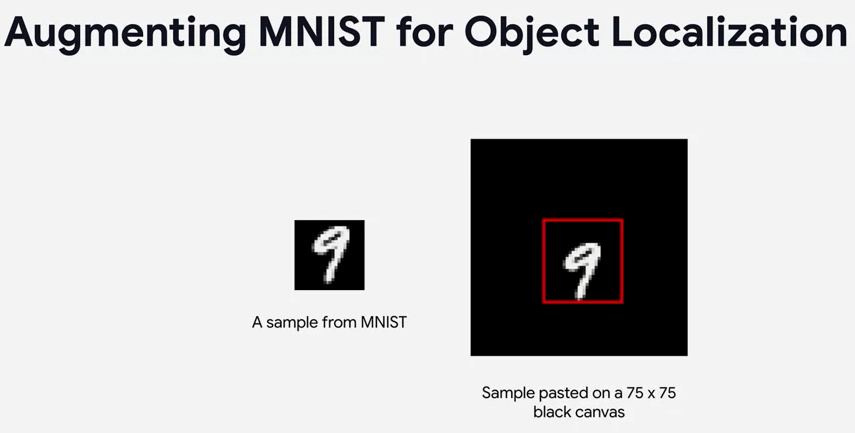
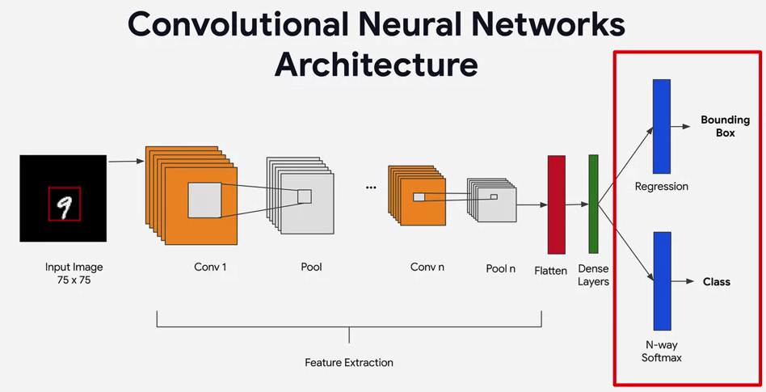
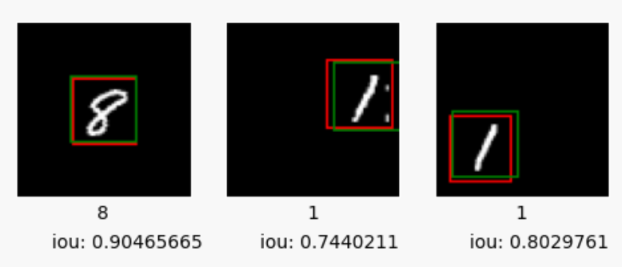
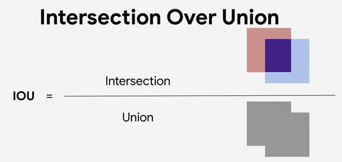

# Object Localization and Classification with One Network on MNIST Dataset

This repository contains code and resources for performing object localization and classification using a single network on an Augmented MNIST dataset. The project aims to demonstrate how a convolutional neural network (CNN) can be trained to not only classify handwritten digits but also localize the bounding boxes around them.

## Table of Contents

- [Introduction](#introduction)
- [Objective](#objective)
- [Network Architecture](#network-architecture)
- [Evaluation Object Localization by (IOU)](#evaluation-object-localization-by-iou)
- [Getting Started](#getting-started)
- [Contributing](#contributing)
- [License](#license)

## Introduction

Object localization refers to the process of identifying the location of objects within an image, often by drawing bounding boxes around them. Classification, on the other hand, involves assigning a label or class to an object. This project combines both tasks by training a CNN to recognize and locate handwritten digits in the MNIST dataset.
The MNIST dataset consists of 60,000 training images and 10,000 test images of handwritten digits. Each image is grayscale and has a resolution of 28x28 pixels. The dataset is widely used as a benchmark for image classification tasks.

## Objective

In object detection, you don't just classify what's in the image. But you'll also identify where the object is located using a bounding box. In this repository, we'll take a look at how you can get started building your own object detectors. We'll start with a simple object localizer which locates the main item in an image using a bounding box. And then later you'll expand on this to build an object detector, which finds all objects of interest within the image. To get started with object localization I want you to give you a simple data set that could be used to create a simple model. You should be familiar with the end this data set by now where there are 60,000 handwritten digits. And 10 classes from 0 through 9 stored in 28 by 28 images, you can see an example
of one on the left in the following image.

The image is always centered so it's not a good example for object detection. Because each bounding box for all training images will be centered in the same place. Which means the model couldn't learn how to identify images that are not centered. So instead, you'll write the code to create a synthesized data set from MNIST. Where instead of 28 by 28, it's 75 by 75 and the image isn't always centred. It will be randomly placed in the 75 by 75 frame and a bounding box will be created for you. And this will give you a basic training set that you can use to learn how to do object localization.

## Network Architecture

Let's explore the architecture that we can use to do detection with this data set. You'll need a two output network, because we'll see that we have one output with the classification and that is what it sees in the image. The digit is that a three is zero or nine, and then the other output will be the location of the bounding box. So let's look at this piece by piece, first of all the image is fed in and it's a 75 by 75 image, so
our input layer is scaled to that size. We have multiple layers of convolutions and pooling to help us with the classification to determine the contents of the image. And what it is that we're looking at which is named feature extraction, and this is no different than a simple MNIST classifier. And as with just about every other classifier the output is flattened and fed into dense layers for classification. But the key difference here with the outputs is that instead of just one output with the image classes we've typically seen. 

We've two outputs, one with the class and one with the location of the bounding box. The bounding box is predicted with a regression, which is a numerical prediction representing the location. And the dimensions of the bounding box, the bounding box prediction is learned from the input labels. The mapping function that converted the MNIST 28 by 28 to a 75 by 75, also adds these bounding boxes as a part of each label. So we can have one output from the dense layers to predict these bounding boxes. Given that we now have this complexity in the network, multiple outputs will naturally have to use the functional API. And other than the fact that we're using the functional API to be another output from the dense layers. The classification output is just the same as you're used to, it's 10 neurons activated by Softmax with one neuron per digit.

## Evaluation Object Localization by (IOU)

There's one more concept that you'll need to understand. That's how to evaluate model performance with object detection. It's not quite as easy as it is with classification where we know the image is correct or not. We also need another metric to measure whether the bounding box is correct or not. We'll use a metric called intersection over union. For example, consider these images.

The bounding box label is in green and the model's prediction of
the bounding box is in red. We can eyeball them to see which ones are pretty good and which ones are not, but it would be best to have a metric that we can use to definitively describe whether a predicted bounding box is good or bad, and that's where IoU intersection over union is really handy. The IoU metric quantifies the visual intuition about whether two boxes are aligned. 

Consider that these two boxes, your predicted one and the true one. To calculate IoU, you measure the intersection, which is the area where the two boxes overlap. You can also measure the union, which is the total area that's covered by a union of the two boxes. Divide the intersection by the union and you'll get a number that ranges from 0-1. A very poor prediction where the boxes aren't even intersecting would get an IoU of zero. A prediction with some intersection between label and prediction would be between 0 and 1. A very good prediction with the intersection nearly the same as the union would be very close to 1.

## Getting Started

To get started with this project, follow these steps:

1. Click this link to open the notebook in Colab: https://colab.research.google.com/github/barzansaeedpour/object-localization-and-classification-with-one-network/blob/main/Object_Localization_and_classification.ipynb

2. The instruction and explaination of the code is mentioned in the notebook

## Contributing

Contributions to this repository are welcome. If you find any issues or have suggestions for improvements, feel free to open an issue or submit a pull request.

## License

This project is licensed under the [MIT License](LICENSE). Feel free to use and modify the code as per the terms of the license.